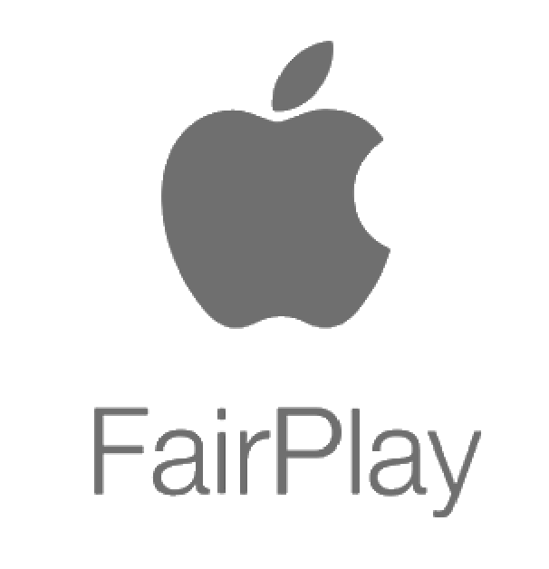

 

    

  <h3 align="center">iOS FairPlay Streaming</h3>

  

    FairPlay Streaming Programming Guide!
     
   
  

<!-- TABLE OF CONTENTS -->

  
Table of Contents

  <ol>
    <li> <a href="#about-the-fairplay-streaming">About FairPlay Streaming</a></li>
    <li><a href="#prerequisites">Prerequisites</a></li>
    <li><a href="#getting-started">Getting Started</a></li>
    <li><a href="#license">License</a></li>
    <li><a href="#contact">Contact</a></li>
    <li><a href="#acknowledgements">Acknowledgements</a></li>
  </ol>

<!-- ABOUT THE PROJECT -->
## About The FairPlay Streaming

Apple FairPlay Streaming (FPS) securely delivers keys to Apple mobile devices, Apple TV, and Safari on macOS and iOS, which will enable playback of encrypted video content. This content is delivered over the Web using HTTP Live Streaming (HLS) technology.
FPS protects the delivery of keys that decrypt streamed audio and video media. An Apple device or computer can securely acquire a key from a content provider's key server. The operating system uses the key to decrypt the media before playback.
FPS key delivery offers the following features:
<ul>
        <li>AES 128-bit content keys are generated by the key server.</li>
        <li>Every key is known only to the key server and to the Apple device.</li>
        <li>When playback is stopped, the key for the iOS device, Apple TV, or Safari on macOS and iOS is permanently discarded from memory.</li>
        <li>The key server can specify the duration of the key's validity for iOS and Apple TV.</li>
        <li>MPEG-2 file formats are supported for protection.</li>
</ul>
<b style="color:MediumSeaGreen;">One key thing to note is Fairplay HLS streaming will only work on a real Apple device, not on a simulator.
</b>  

<!-- Prerequisite -->
## Prerequisites
<ul>
<li>Manifest URL of the HLS stream.</li>
<li>Fairplay Application certificate of the content provider.</li>
<li>Content Identifier.</li>
<li>Key Server Module or DRM server URL</li>
</ul>
 

<!-- GETTING STARTED -->
## Getting Started

[![Product Name Screen Shot][product-screenshot]](https://example.com)
  
 Now, getting down to how exactly it works on the media player because we need to have a clear understanding of this process.  
 <b>So, breaking it in steps</b>
<ol>
<li>The app asks the the native player to play specific content identified by a URL, here we give the manifest URL to the AVPlayer.    <pre>https://videodrmmediaservice-euwe.streaming.media.azure.net/3eb925e7-04fa-4a02-8d3m-2b0d9a864keb/test.ism/manifest(format=m3u8-aapl,encryption=cbcs-aapl)</pre></li>
<li>The player accesses the content and checks its playlist.</li>
 
<li>An attribute in the playlist identifies the content as encrypted by a content key obtainable through FPS.</li>
 
<li>The iOS informs the app that the content is encrypted using FPS, (here an implemented <b style="color:Tomato;">AVAssetResourceLoaderDelegate</b> protocol method will be invoked in application code)</li>
 
<li>The app asks the iOS to prepare an FPS message that requests the content key.</li>
 
<li>The iOS delivers an encrypted Server Playback Context (SPC) message to the app.</li>
 
<li>The app sends the SPC to a key server that contains a KSM.</li>
 
<li>The KSM decrypts the SPC and gets the requested content key from the key server.
</li>
 
<li>The KSM wraps the content key inside an encrypted content key context (CKC) message, which it sends to the app.</li>
 
<li>The app delivers the CKC to FPS software integrated in the operating system. The CKC is used to decrypt the media content and plays the content.</li>
</ol>

<!-- LICENSE -->
## License

Distributed under the MIT License.

<!-- CONTACT -->
## Contact

Mostafa Shuman - [@twitter](https://twitter.com/mostafa_shuman1) - mostafa.shuman@hotmail.com

<!-- ACKNOWLEDGEMENTS -->
## Acknowledgements
* [HTTP Live Streaming](https://developer.apple.com/streaming/fps/)
* [Azure Protect your HLS content with Apple FairPlay](https://docs.microsoft.com/en-us/azure/media-services/previous/media-services-protect-hls-with-fairplay)

<!-- MARKDOWN LINKS & IMAGES -->
<!-- https://www.markdownguide.org/basic-syntax/#reference-style-links -->
[contributors-shield]: https://img.shields.io/github/contributors/othneildrew/Best-README-Template.svg?style=for-the-badge
[contributors-url]: https://github.com/othneildrew/Best-README-Template/graphs/contributors
[forks-shield]: https://img.shields.io/github/forks/othneildrew/Best-README-Template.svg?style=for-the-badge
[forks-url]: https://github.com/othneildrew/Best-README-Template/network/members
[stars-shield]: https://img.shields.io/github/stars/othneildrew/Best-README-Template.svg?style=for-the-badge
[stars-url]: https://github.com/othneildrew/Best-README-Template/stargazers
[issues-shield]: https://img.shields.io/github/issues/othneildrew/Best-README-Template.svg?style=for-the-badge
[issues-url]: https://github.com/othneildrew/Best-README-Template/issues
[license-shield]: https://img.shields.io/github/license/othneildrew/Best-README-Template.svg?style=for-the-badge
[license-url]: https://github.com/othneildrew/Best-README-Template/blob/master/LICENSE.txt
[linkedin-shield]: https://img.shields.io/badge/-LinkedIn-black.svg?style=for-the-badge&logo=linkedin&colorB=555
[linkedin-url]: https://linkedin.com/in/othneildrew
[product-screenshot]: images/screenshot.png
